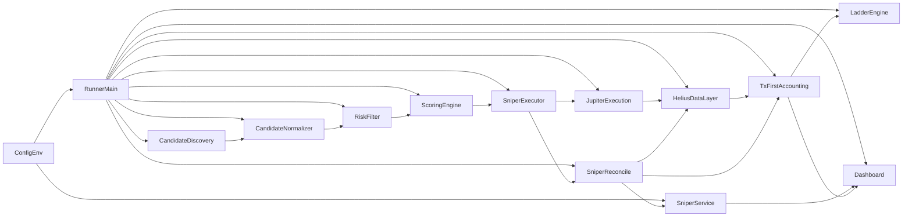

### Updated `SNIPER_IMPLEMENTATION_SPEC.md` (patched)

Below is the **patched** implementation spec incorporating all requested corrections. This replaces the previous draft.

---

## 1. Scope and Constraints

- **Scope**: Phase 1 **manual-seed sniper** only, fully integrated with:
  - Helius-first observation
  - tx-first accounting engine
  - Jupiter execution path
  - ladder engine
  - dashboard observability
- **Non‑negotiable invariants**:
  - **CHAIN TRUTH OVERRIDES INTENT**
  - No synthetic lots or balances
  - No dashboard-triggered trading
  - No second inventory model
  - No bypass of Helius + tx-first

---

## 2. Architecture (updated diagram + placement)

**Placement summary**:

- `SniperService` is invoked **once per runner cycle**, after tx-first reconciliation and before ladder.
- Sniper:
  - Reads **only** canonical runtime state + status.
  - Writes **only** sniper-specific metadata/events; **never** mutates lots/balances directly.
- Lot enrichment + ladder arming happen **after** tx-first has built lots and **only** via metadata hooks.

---

## 2.1 Venue Coverage Model

The sniper engine is designed around a **generic core** plus a pluggable **Venue Adapter layer** so it can support current and future Solana venues (launchpads, AMMs, routed DEXes, wallet-follow, feeds) without changing accounting, ladder, or dashboard contracts.

### 2.1.1 Generic Core Coverage

The **generic sniper core** assumes only that a target asset is:

- **Observable** through Helius (transaction history, inner instructions, token movements).
- **Executable** through Jupiter or a future approved execution adapter.
- **Reconcilable** through the existing **tx-first accounting** engine.
- **Representable** as a normal lot once the buy is confirmed on-chain.

Generic core responsibilities (venue-agnostic):

- Candidate data model (fields, identity, scoring inputs).
- Deterministic risk model (liquidity, slippage, exposure, rate limits).
- Transparent scoring model.
- Buy intent and sizing function (e.g. Phase 1 constant-size rule).
- Execution request assembly (quote parameters, route constraints).
- Reconciliation contract (what evidence is needed to call an attempt `resolved_success`).
- Tx-first lot linkage and sniper metadata attachment.
- Ladder arming for sniper-acquired lots.
- Observability and dashboard reporting (sniper summary, attempts, decisions, positions).

All venue-specific details must be mapped into this generic core model; the core does **not** know about particular launchpads, bonding curves, or feed schemas.

### 2.1.2 Venue Adapter Layer

The **Venue Adapter layer** introduces a formal `VenueAdapter` concept for source- and venue-specific behavior that the generic core should never hardcode.

Each adapter is responsible for converting raw, venue-specific information into **normalized sniper candidates** and associated hints:

- `venue_id`: stable identifier for the venue (e.g. `manual_seed`, `pumpfun`, `moonshot`, `generic_routed_token`).
- `category`: adapter family (see categories below: manual, wallet_follow, launchpad, dex_liquidity, market_feed, social_signal, venue_execution).
- `discovery_method`: how raw candidates appear (polling, webhooks, Helius-derived, status.json, CLI, etc.).
- `normalization_logic`: mapping from venue-native fields → `SniperCandidate` (mint, symbol, liquidity, volume, age, activity, discovery_source, etc.).
- `launch_stage_classification`: mapping a candidate into a **venue stage** (`pre_trade`, `venue_native_only`, `early_launch`, `routed_liquidity`, `mature_liquidity`).
- `routability_detection`: whether the candidate is safely executable via **generic routed liquidity** (e.g. Jupiter) or requires a venue-native path.
- `metadata_enrichment`: additional structured fields for debugging/analysis (launch URL, creator info, pool addresses, social links, etc.).
- `risk_overrides`: venue-specific hardening (e.g. stricter caps for bonding-curve launches, minimum liquidity for launchpad tokens, exclusion lists).
- `source_confidence`: adapter-specific view of data completeness/quality (for observability, not for synthetic confidence in PnL).
- `execution_constraints`: limits on how the generic core may execute (e.g. no market orders until routing is stable, min/max slippage for this venue).
- `reconciliation_hints`: metadata that simplifies tx-first matching (expected program IDs, inner-instruction patterns, known wrappers).

The generic core remains **venue-agnostic**:

- It receives already-normalized candidates, risk overrides, and hints from adapters.
- It decides eligibility, scoring, execution, and reconciliation using its deterministic rules.
- It never needs to know **how** Pump-style launches, Moonshot launches, BONK launchpads, or future venues encode their state; that is adapter territory.

Venue adapters live **upstream** of the core; they never create balances or lots, and they never bypass Helius/tx-first.

### 2.1.3 Adapter Category Taxonomy

The system groups adapters into **families** rather than hardcoding individual venues:

- **A. Manual / Operator Sources**
  - Examples: `manual_seed`, curated watchlists, imported mint lists, operator priority lists.
  - Purpose: controlled testing, curated conviction entries, fallback when automation is disabled.

- **B. Wallet-Follow / Signal Sources**
  - Examples: `watch_wallet`, `smart_wallet_copy`, internal copy-trade signals.
  - Purpose: discover candidates by observing tracked wallets’ real purchases.

- **C. Launchpad / Fair-Launch Sources**
  - Examples: `pumpfun`, `moonshot`, `letsbonk` / BONK launchpad, general bonding-curve/fair-launch venues.
  - Purpose: detect newly launched tokens before or during early liquidity phases.

- **D. DEX / AMM Liquidity Sources**
  - Examples: Jupiter-routable tokens, Raydium-style pools, Orca/Meteora pools, future AMMs.
  - Purpose: identify tokens already trading in standard routed liquidity environments; natural fit for Jupiter-based execution.

- **E. Market / Discovery Feed Sources**
  - Examples: trending feeds, volume/volatility spike feeds, new-pair creation feeds, liquidity-increase feeds, screener-style feeds.
  - Purpose: discover candidates from **market behavior** (price/volume/liquidity) instead of wallet behavior.

- **F. Social / External Signal Sources**
  - Examples: curated signal channels, sentiment feeds, launch announcements, internal scoring services.
  - Purpose: enrich/prioritize candidates; **never** bypass deterministic risk and accounting rules.

- **G. Future Execution-Venue Sources**
  - Examples: venue-native execution paths not safely handled via generic Jupiter routing.
  - Purpose: only when a venue can’t be supported safely through Jupiter (later phases, subject to explicit approval).

### 2.1.4 Venue Stage Model

Every adapter must classify its candidates into a **venue stage**:

1. `pre_trade`
   - Token/venue is visible but **not yet tradable** (e.g. pre-launch metadata only).
2. `venue_native_only`
   - Tradable only through venue-specific mechanisms (e.g. launch contract UI) and **not yet safe** for generic routed execution.
3. `early_launch`
   - Executable but fragile: thin liquidity, high slippage, or special rules apply.
4. `routed_liquidity`
   - Tradable through **generic routed DEX liquidity** (e.g. Jupiter can find a route with acceptable risk).
   - Preferred state for Phase 1/2 sniper logic.
5. `mature_liquidity`
   - Deeper, more stable routed liquidity; can potentially support more aggressive scoring/sizing in later phases.

Stage classification is an input into:

- Risk filters (e.g. block `pre_trade`, `venue_native_only` in Phase 1).
- Execution eligibility (Phase 1 focuses on `routed_liquidity`/`mature_liquidity` only).
- Future adapter-specific rules for early-launch venues.

### 2.1.5 VenueAdapter Interface (Conceptual)

Conceptually, each adapter implements the following methods (or equivalent):

- `discover_candidates(context) -> list[RawCandidate]`
  - Yields raw, venue-native candidate objects to be normalized.

- `normalize_candidate(raw_candidate, context) -> SniperCandidate`
  - Converts raw venue data into the generic `SniperCandidate` model (mint, symbol, liquidity, volume, age, activity, discovery_source, etc.).

- `classify_stage(candidate, context) -> str`
  - Returns one of: `pre_trade`, `venue_native_only`, `early_launch`, `routed_liquidity`, `mature_liquidity`.

- `is_routable(candidate, context) -> bool`
  - True when the candidate is safely executable via generic routed liquidity (e.g. Jupiter) under current conditions.

- `get_execution_mode(candidate, context) -> str`
  - Returns an execution mode hint, e.g. `generic_routed`, `venue_native`, `disabled_for_venue`.
  - Phase 1: only `generic_routed` is allowed; venue-native execution is a future-phase exception.

- `get_metadata(candidate, context) -> dict`
  - Adapter-specific metadata for observability (e.g. launch URL, creator, program IDs).

- `get_risk_overrides(candidate, context) -> dict`
  - Venue-specific hardening (e.g. additional min liquidity, slippage caps, exposure caps, blacklists).

- `get_reconciliation_hints(candidate, context) -> dict`
  - Hints for Helius/tx-first reconciliation (e.g. expected program IDs, known inner-instruction structures).

These outputs feed the **generic sniper pipeline** (normalization, risk, scoring, execution, reconciliation). The core **never** needs to parse venue-native formats itself; new venues are onboarded by adding adapters, not by changing the core or tx-first engine.

---

## 3. Runtime State Model (additions to `state.json`)

All types are conceptual contracts: **field names, types, semantics**.

### 3.1 New fields

#### `sniper_pending_attempts`

- **Type**: `Dict[str, SniperAttemptState]`
  - Key: `attempt_id: str` (globally unique).
- **Legal states stored here** (non‑terminal only):
  - `created`
  - `quoted`
  - `submitted`
  - `pending_chain_observation`
  - `observed_candidate_receipt`
- **Terminal states are **never** stored here**:
  - `quote_rejected`
  - `resolved_success`
  - `resolved_failed`
  - `resolved_uncertain`
- **Updated where**:
  - `SniperService` / `SniperExecutor` when creating/updating non‑terminal attempts.
  - `SniperReconcile` when moving attempts between non‑terminal states.
  - On transition to any terminal state, **remove** from `sniper_pending_attempts`.
- **Max retention**:
  - Only non‑terminal attempts; terminal attempts move into history (see below).
- **Persisted**: **Yes**.
- **Clean start**: `{}`.
- **Bootstrap from status**:
  - Initialize as `{}` (no resurrection from wallet status alone).

#### `sniper_attempt_history`

- **Type**: `List[SniperAttemptHistoryEntry]`
- **Contains only terminal attempts**:
  - `quote_rejected`
  - `resolved_success`
  - `resolved_failed`
  - `resolved_uncertain`
- **Updated where**:
  - On any transition from a non‑terminal to a terminal state.
- **Max retention**:
  - Bounded: `SNIPER_MAX_ATTEMPT_HISTORY` (default 100).
  - Trim oldest on append.
- **Persisted**: Yes.
- **Clean start / bootstrap**:
  - Empty on first run; restored if prior `state.json` exists.

#### `sniper_last_decisions`

- **Type**: `List[SniperDecisionEntry]`
- **Updated where**:
  - `SniperService` whenever a **decision outcome** from the fixed outcome enum is produced (see Section 7.5).
- **Max retention**:
  - Bounded: `SNIPER_MAX_DECISION_HISTORY` (default 200).
- **Persisted**: Yes.
- **Clean start / bootstrap**: Empty, forward-only.

#### `sniper_candidate_cooldowns`

- **Type**: `Dict[str, SniperCooldownEntry]` (keyed by `mint`)
- **Fields in `SniperCooldownEntry`**:
  - `mint: str`
  - `last_attempt_at: int | None` (unix ts)
  - `last_success_at: int | None`
  - `last_full_exit_at: int | None`
- **Updated where**:
  - When attempts reach terminal states:
    - On **any** terminal attempt (`quote_rejected`, `resolved_failed`, `resolved_uncertain`, `resolved_success`): update `last_attempt_at`.
    - On `resolved_success`: update `last_success_at`.
  - When **full exit** is detected (see Section 7.8): update `last_full_exit_at`.
- **Retention / cleanup**:
  - Periodic cleanup to drop entries:
    - With no open lots for that mint.
    - And `now - max(last_attempt_at, last_full_exit_at, last_success_at)` > `SNIPER_COOLDOWN_RETENTION_SECONDS`.
- **Persisted**: Yes.
- **Clean start / bootstrap**: Empty.

#### `sniper_recent_success_timestamps_hour`

- **Type**: `List[int]` (unix ts)
- **Updated where**:
  - When an attempt transitions to `resolved_success`.
- **Retention**:
  - Keep only timestamps within last 3600 seconds.
- **Persisted**: Yes.

#### `sniper_recent_success_timestamps_day`

- **Type**: `List[int]`
- **Updated where**:
  - Same as above.
- **Retention**:
  - Keep only timestamps within last 86400 seconds.
- **Persisted**: Yes.

#### `sniper_manual_seed_queue`

- **Type**: `List[SniperManualSeedQueueEntry]` (**not** plain strings)
- **`SniperManualSeedQueueEntry` schema**:
  - `mint: str`
  - `enqueued_at: int`  (unix ts)
  - `source: str` (Phase 1: always `"manual_seed"`)
  - `note: str | None` (optional operator note; may be `None` uncodified)
- **Updated where**:
  - Operator-facing enqueue API.
  - `SniperService` when dequeuing and deciding candidates.
- **Dedup semantics**:
  - On enqueue:
    - Reject if an entry with same `mint` already exists in queue.
- **Max size**:
  - Bounded: `SNIPER_MAX_MANUAL_QUEUE_SIZE`.
- **Persisted**: Yes (persistent across restart).
- **Clean start**: Empty list.

#### `sniper_stats`

- **Type**: `SniperStats` object.
- **Fields and **exact increment rules**:

  - `total_candidates_seen: int`  
    - Increment when a candidate is **dequeued** from `sniper_manual_seed_queue` for processing.

  - `total_candidates_blocked_risk: int`  
    - Increment when a candidate is rejected at risk stage:
      - `SNIPER_RISK_BLOCKED` with stage `'risk'`.

  - `total_candidates_blocked_duplicate: int`  
    - Increment when a candidate is rejected for duplicate/open-lot/pending-attempt reasons:
      - `SNIPER_DUPLICATE_BLOCKED`.

  - `total_candidates_blocked_cooldown: int`  
    - Increment when a candidate is rejected due to cooldown:
      - `SNIPER_COOLDOWN_BLOCKED`.

  - `total_attempts: int`  
    - Increment **once**, when an attempt enters `created`.

  - `total_successful_attempts: int`  
    - Increment when an attempt enters `resolved_success`.

  - `total_failed_attempts: int`  
    - Increment when an attempt enters `resolved_failed`.

  - `total_uncertain_attempts: int`  
    - Increment when an attempt enters `resolved_uncertain`.

  - (Optional) `total_quote_rejected_attempts: int`  
    - If implemented: increment when an attempt enters `quote_rejected`.
    - **Does not** increment `total_failed_attempts`.

- **Persisted**: Yes.
- **Clean start / bootstrap**: Zero-initialized or restored.

#### `processed_sniper_signatures`

- **Type**: `List[str]` (transaction signatures)
- **Purpose**:
  - Idempotency: prevent double-processing the same signature for sniper.
- **Updated where**:
  - When reconciliation successfully **matches** a sniper attempt to a signature (success or clear failure).
- **Max retention**:
  - Bounded: `SNIPER_MAX_PROCESSED_SIGNATURES`.
- **Persisted**: Yes.
- **Clean start / bootstrap**: Empty or restored; missing historical signatures simply mean “no prior processing”.

> **No economic truth is stored here**. All balances, lot sizes, prices and PnL remain owned by the tx-first engine.

---

## 4. SniperAttempt Lifecycle State Machine

### 4.1 Legal states

`SniperAttempt.state` ∈:

- Non‑terminal:
  - `created`
  - `quoted`
  - `submitted`
  - `pending_chain_observation`
  - `observed_candidate_receipt`
- Terminal:
  - `quote_rejected`
  - `resolved_success`
  - `resolved_failed`
  - `resolved_uncertain`

Only non‑terminal attempts reside in `sniper_pending_attempts`. All terminal attempts move to `sniper_attempt_history` and are removed from `sniper_pending_attempts`.

### 4.2 Attempt creation semantics

- An **attempt** object is created only **after**:
  - Candidate has passed risk filters.
  - Candidate has passed scoring (`score ≥ SNIPER_MIN_SCORE`).
  - Global/mint constraints (rate limits, cooldown, duplicate, exposure) are satisfied.
- Creation itself does **not** imply quote success:
  - A `created` attempt can later become `quote_rejected` (terminal).

### 4.3 Transitions

Summarized with corrections:

- `null → created`
  - Trigger: `SniperService` decides to trade candidate.
  - Effects:
    - `total_attempts++`.
- `created → quoted`
  - Trigger: safe Jupiter quote obtained.
- `created → quote_rejected`
  - Trigger: no safe quote or deterministic quote failure.
  - Terminal:
    - Attempt removed from `sniper_pending_attempts`.
    - Added to `sniper_attempt_history`.
    - `sniper_stats.total_quote_rejected_attempts++` (if implemented).
    - `sniper_stats.total_attempts` **not** incremented again.
- `quoted → submitted`
  - Trigger: live mode; swap submission succeeds (signature obtained).
- `submitted → pending_chain_observation`
  - Trigger: signature persisted; immediate internal step.
- `pending_chain_observation → observed_candidate_receipt`
  - Trigger: Helius reports matching signature with positive candidate mint credit (Tier 1 evidence).
- `observed_candidate_receipt → resolved_success`
  - Trigger: tx-first engine confirms one or more lots built for this tx+mint; lot-linking rules satisfied.
  - Effects:
    - `total_successful_attempts++`.
    - Update `sniper_recent_success_timestamps_hour/day`.
    - Update cooldowns: `last_attempt_at`, `last_success_at`.
    - Attempt removed from `sniper_pending_attempts` and appended to history.
- `submitted`/`pending_chain_observation` → `resolved_failed`
  - Trigger: explicit Helius failure, or completed reconciliation with no candidate mint lot.
  - Effects:
    - `total_failed_attempts++`.
    - Update cooldown: `last_attempt_at`.
    - Move to history.
- `submitted`/`pending_chain_observation` → `resolved_uncertain`
  - Trigger: timeout: `now - submitted_at > SNIPER_ATTEMPT_UNCERTAIN_TIMEOUT_SECONDS` and no Tier 1 success/failure evidence.
  - Effects:
    - `total_uncertain_attempts++`.
    - Update cooldown: `last_attempt_at`.
    - Move to history.
  - Phase 1: **final**; no later auto‑promotion.

### 4.4 Timeout policy

- `SNIPER_ATTEMPT_UNCERTAIN_TIMEOUT_SECONDS` (e.g. 600s).
- Until timeout:
  - Reconciliation tries to determine `resolved_success` or `resolved_failed`.
- After timeout:
  - If still unresolved: mark `resolved_uncertain` once; no retry.

---

## 5. Lot-Linking Deterministic Rules

Same as prior spec, with emphasis:

- Precedence:
  1. Exact signature match.
  2. Candidate mint match.
  3. Time window checks.
  4. Positive mint delta.
  5. Optional input/source mint sanity.
  6. Multiple lots from same tx → attach metadata to all lots of that mint from that tx.

- Special cases (same tx multiple mints, existing wallet balance, ATA creation, token→token, partial fills) are handled with the same rules; sniper **never** overrides tx-first economics.

---

## 6. Reconciliation Evidence Levels

Unchanged structurally, but Phase 1 rule made explicit:

- **Phase 1**:
  - `resolved_success` requires **Tier 1** evidence:
    - Signature match + positive candidate mint movement.
  - `SNIPER_ALLOW_TIER2_SUCCESS = false` by default.
  - Tier 2 support may exist in code but disabled by config.

---

## 7. Candidate Identity, Dedup, Cooldown, Full-Exit Rules

### 7.1 `candidate_id` generation (Phase 1)

- For manual-seed candidates:

  \[
  \text{candidate\_id} = \text{sha256}(\text{\"manual\_seed|\"} + \text{mint} + \text{\"|\"} + \text{str(enqueued\_at)})[0:16]
  \]

- Uses:
  - `mint`
  - `enqueued_at` from `SniperManualSeedQueueEntry`
  - Constant `"manual_seed"` source.
- Deterministic for a given queue entry; distinct per enqueue (if it were allowed).

### 7.2 Same-candidate semantics

- Phase 1 risk/cooldown/concurrency is **per-mint**:
  - Multiple `candidate_id`s for same mint share the same risk constraints.
  - Queue dedup ensures a mint appears at most once in `sniper_manual_seed_queue`.

### 7.3 Manual-seed duplicates

- On enqueue:
  - If same `mint` exists in queue or:
    - Has pending attempt (non‑terminal).
    - Has any open lot.
    - Is quarantined/non‑tradable.
  - → reject enqueue with explicit reason.

### 7.4 Cooldown bases

- **Re-entry cooldown**:
  - Allowed only when:
    - There are **no open lots** for that mint (of any acquisition_reason).
    - And `now - last_full_exit_at(mint) >= SNIPER_REENTRY_COOLDOWN_SECONDS`.
- **Re-attempt cooldown**:
  - Additional guard:
    - `now - last_attempt_at(mint) >= SNIPER_REATTEMPT_COOLDOWN_SECONDS` before new attempt.

### 7.5 Full-exit trigger (`last_full_exit_at`)

- `last_full_exit_at(mint)` updated only when canonical lot inventory shows:

  - **Zero remaining quantity across all lots for that mint**, regardless of acquisition_reason.

- This is computed in the **accounting layer / ladder integration** where lot states are visible, not inside sniper alone.

### 7.6 Pending attempt blocking

- Strict Phase 1 rule:
  - **One pending attempt per mint**:
    - If any attempt for `mint` exists in `sniper_pending_attempts`, no new attempt for that mint may be created.

### 7.7 Existing lot blocking

- Phase 1:
  - If **any open lot exists** for `mint`:
    - Sniper entry for that mint is blocked (duplicate-protection).
  - If mint is quarantined / non-tradable:
    - Hard block.

---

## 8. Definition of “Open Sniper Position”

Same as previous, but clarified:

- An “open sniper position” for a mint exists if:

  - At least one open lot has:
    - `acquisition_reason == 'sniper'`
    - `remaining_quantity > 0`.

- Mixed exposure:
  - Concurrency cap is **per-mint**:
    - One or more sniper lots in same mint count as **one** open sniper position.
  - Exposure metrics can sum sniper lots separately from non-sniper.

---

## 9. Manual-Seed Operator Flow

Now using `SniperManualSeedQueueEntry`:

- **Queueing**:
  - Operator calls enqueue with:
    - `mint: str`
    - optional `note: str`
  - System creates `SniperManualSeedQueueEntry`:
    - `mint`, `enqueued_at=now`, `source='manual_seed'`, `note`.
- **Validation**:
  - Valid mint format.
  - Not already in queue.
  - No open lots, no pending attempt, not quarantined/non-tradable.
  - Queue size < `SNIPER_MAX_MANUAL_QUEUE_SIZE`.
- **Draining**:
  - Each cycle: process up to `SNIPER_MAX_CANDIDATES_PER_CYCLE` entries from head of queue.
  - For each entry:
    - Emit `SNIPER_CANDIDATE_DISCOVERED`.
    - Normalize → risk → score.
    - If blocked: emit reason, record decision, remove from queue.
    - If attempt created: remove from queue; further state tracked via attempts.

- **Dashboard evidence**:
  - Display queue size + sample entries (mint, enqueued_at, note, source).

---

## 10. Live vs Paper Mode

### 10.1 Hard rule for state

- **Phase 1**:
  - `state.json` stores **live sniper state only**.
  - Paper-mode attempts/decisions are **not** persisted in `state.json`.
  - Paper mode may emit events/logs and live in in-memory structures only.

### 10.2 Behavior

- **Paper mode**:
  - Runs discovery/normalize/risk/score and optionally quote.
  - Does **not**:
    - Submit swaps.
    - Create SniperAttempt entries in `sniper_pending_attempts`.
    - Create or update any sniper fields in `state.json`.
    - Link to lots or arm ladders.
  - Dashboard:
    - May show paper decisions separately, clearly marked as `mode='paper'`, but based on ephemeral in-memory state or current cycle summary only.
- **Live mode**:
  - Full path (attempt creation, submission, reconciliation, lot-link, ladder arming, persisted sniper state).

---

## 11. Risk Sizing Formula (Phase 1)

Same as previous, unchanged:

\[
\text{proposed\_buy\_sol} = \min(
  \text{SNIPER\_DEFAULT\_BUY\_SOL},
  \text{SNIPER\_MAX\_BUY\_SOL},
  \text{wallet\_free\_sol} - \text{SNIPER\_WALLET\_SOL\_RESERVE},
  \text{remaining\_global\_risk\_capacity}
)
\]

- Reject if:
  - `wallet_free_sol - SNIPER_WALLET_SOL_RESERVE <= 0` or
  - `proposed_buy_sol < SNIPER_MIN_BUY_SOL`.

---

## 12. Exact Event Taxonomy and Payloads

Same as previous, with minor typo fix:

- In `SNIPER_CANDIDATE_SCORED`:
  - `weights: Dict[str, float]` (typo fixed).

All other event shapes stand as previously specified.

---

## 13. Runner Cycle Integration Order

Same as prior section, unchanged in ordering:

1. Refresh status / market context.
2. Ingest wallet tx (Helius).
3. Run tx-first reconciliation.
4. Ingest external sells.
5. Resolve pending sniper attempts (reconciliation).
6. Process manual-seed queue (discovery).
7. Normalize + risk + score.
8. Submit at most N live sniper buys.
9. Run ladder engine.
10. Build dashboard payload.
11. Persist state.

---

## 14. Dashboard Payload Contract

Unchanged except queue entries now richer; `manual_seed_queue_size` remains scalar, but additional queue info may be exposed from `SniperManualSeedQueueEntry`.

---

## 15. Retention and Cleanup

Same as previous spec; now also consider:

- `sniper_manual_seed_queue` bounded by `SNIPER_MAX_MANUAL_QUEUE_SIZE`.
- `sniper_candidate_cooldowns` cleaned using `SNIPER_COOLDOWN_RETENTION_SECONDS`.

---

## 16. Phase 1 Test Matrix

Same set as previously defined; plus:

- Tests for:
  - `quote_rejected` counted correctly (attempt/hist/stat behavior).
  - `SniperManualSeedQueueEntry` serialization round-trip.
  - Outcome enum correctness in `sniper_last_decisions`.

---

## 17. Idempotency Guarantees

Sniper must be **idempotent across runner cycles and replays**.

- **Attempts**:
  - Once an attempt reaches a terminal state, it is not modified again.
  - `sniper_pending_attempts` only contains non-terminal states; repeated processing of a terminal attempt is impossible by design.
- **Signatures**:
  - `processed_sniper_signatures` ensures each signature is reconciled at most once per attempt.
  - Re-seeing the same signature must not:
    - Create new attempts.
    - Change terminal states.
    - Append duplicate history entries.
- **Lot metadata**:
  - Before attaching sniper metadata to a lot, check whether it is already present:
    - If attached, skip; no double-writing.
- **Ladder arming**:
  - Before arming, check lot’s ladder state:
    - If already armed with same profile, no-op.
    - Emit `SNIPER_LOT_ARMED` only on **first** successful arm for a given lot/strategy.
- **Stats**:
  - Each counter increments only on entering a state for the **first time**:
    - Guard transitions so a state change code path cannot run twice for a given attempt.
- **Events**:
  - Emission is tied to clearly-defined transitions:
    - E.g. `SNIPER_BUY_CONFIRMED` only once per `resolved_success`.
  - Re-running same transition handler must be prevented by state checks.

Repeated runner cycles, repeated reconciliation scans, and repeated Helius observations must leave:

- Lots unchanged.
- Sniper metadata stable.
- Stats and histories free of duplicates.

---

## 18. Phase 1 Config Keys and Defaults

Exact Phase 1 config surface with **example default values** (all can be adjusted, but names are stable):

- `SNIPER_ENABLED` — `false`
- `SNIPER_MODE` — `"disabled"` (values: `"disabled" | "paper" | "live"`)
- `SNIPER_DISCOVERY_ENABLED` — `false` (Phase 1: controls manual-seed discovery)
- `SNIPER_MAX_CANDIDATES_PER_CYCLE` — `3`
- `SNIPER_MAX_MANUAL_QUEUE_SIZE` — `100`
- `SNIPER_DEFAULT_BUY_SOL` — `0.1`
- `SNIPER_MIN_BUY_SOL` — `0.02`
- `SNIPER_MAX_BUY_SOL` — `0.5`
- `SNIPER_WALLET_SOL_RESERVE` — `1.0`
- `SNIPER_MAX_TOTAL_OPEN_RISK_SOL` — `5.0`
- `SNIPER_MAX_CONCURRENT_SNIPER_POSITIONS` — `5`
- `SNIPER_MAX_BUYS_PER_HOUR` — `3`
- `SNIPER_MAX_BUYS_PER_DAY` — `10`
- `SNIPER_REENTRY_COOLDOWN_SECONDS` — `3600`  (1 hour)
- `SNIPER_REATTEMPT_COOLDOWN_SECONDS` — `900`  (15 minutes)
- `SNIPER_ATTEMPT_UNCERTAIN_TIMEOUT_SECONDS` — `600`  (10 minutes)
- `SNIPER_MIN_LIQUIDITY_SOL_EQUIV` — `50.0`
- `SNIPER_MAX_SLIPPAGE_BPS` — `300`  (3%)
- `SNIPER_MIN_SCORE` — `0.6`  (on 0–1 scale)
- `SNIPER_MAX_ATTEMPT_HISTORY` — `100`
- `SNIPER_MAX_DECISION_HISTORY` — `200`
- `SNIPER_MAX_PROCESSED_SIGNATURES` — `500`
- `SNIPER_COOLDOWN_RETENTION_SECONDS` — `604800`  (7 days)
- `SNIPER_ALLOW_TIER2_SUCCESS` — `false` (Phase 1: Tier 1 only)

Claude must implement config loading + validation against this key set and these default ranges.

---

### Summary of Requested Items

- **Phase 1 config defaults table**: see Section 18.
- **Exact queue entry schema**: `SniperManualSeedQueueEntry` in Section 3.1 / 9.
- **Exact decision outcome enum**:
  - `validation_rejected`
  - `duplicate_blocked`
  - `cooldown_blocked`
  - `risk_blocked`
  - `score_blocked`
  - `quote_rejected`
  - `buy_submitted`
  - `buy_confirmed`
  - `buy_failed`
  - `buy_uncertain`
- **Idempotency section**: Section 17.

With these corrections, the spec is now fully consistent and precise enough for implementation.

**Confirmation**: This patched `SNIPER_IMPLEMENTATION_SPEC.md` can be treated as the final Phase 1 build contract. Once you’re ready to leave plan mode and authorize changes, I’ll follow your exact implementation order and begin coding against this spec.

---

## 19. Planned Adapter Roadmap

The adapter system is planned in phases, with **Phase 1 strictly limited to manual_seed** and later phases turning on more venue coverage:

- **Phase 1 — Manual-Seed Only**
  - Adapter: `manual_seed` (category: Manual / Operator).
  - Discovery: CLI / operator queue only.
  - Execution: generic routed (Jupiter) when enabled.

- **Phase 2 — Generic Routed-Token Adapter**
  - Adapter: `generic_routed_token` (category: DEX / AMM Liquidity).
  - Discovery: tokens already Jupiter-routable with sufficient liquidity and volume.
  - Primary goal: support safe routed-liquidity tokens using the generic core.

- **Phase 3 — Launchpad / Fair-Launch Adapters**
  - Adapters: `pumpfun`, `moonshot`, `letsbonk` (and similar fair-launch / bonding-curve venues).
  - Discovery: venue APIs / feeds; Helius-derived events.
  - Focus: `pre_trade` / `venue_native_only` / `early_launch` stages with conservative risk.

- **Phase 4 — Wallet-Follow Adapters**
  - Adapters: `watch_wallet`, `smart_wallet_copy` (category: Wallet-Follow / Signal).
  - Discovery: buys by tracked wallets.
  - All candidates still pass **generic risk + scoring** and are reconciled tx-first.

- **Phase 5 — Market-Feed Adapters**
  - Adapters: `trend_feed`, `liquidity_spike_feed`, `new_pair_feed` (category: Market / Discovery Feed).
  - Discovery: external feeds (trending, volume spikes, new pairs, liquidity jumps).

- **Phase 6 — Venue-Native Execution Adapters**
  - Adapters: venue-specific execution where Jupiter is not sufficient or safe.
  - Only after Risk/CEO approval; tx-first accounting and reconciliation remain unchanged.

### 19.1 Per-Adapter Planning Stubs

For each adapter, we use a consistent planning template.

**manual_seed**

- **Adapter name**: `manual_seed`
- **Category**: Manual / Operator
- **Discovery source**: CLI / operator-enqueued mint list
- **Candidate normalization needs**: basic mint→symbol/decimals resolution, liquidity/volume/price via existing data; no venue-native enrichment.
- **Stage classification rules**: treat as `routed_liquidity` only when Jupiter shows a safe route and liquidity above global thresholds; otherwise blocked.
- **Generic Jupiter-compatible**: Yes (Phase 1 scope).
- **Venue-native execution required**: No.
- **Special risk concerns**: operator mistakes; conservative global limits and manual oversight.
- **Special reconciliation hints**: none beyond generic Jupiter/Helius hints.
- **Phase priority**: **Phase 1** (implemented first).

**generic_routed_token**

- **Adapter name**: `generic_routed_token`
- **Category**: DEX / AMM Liquidity
- **Discovery source**: tokens already tradable via Jupiter with sufficient liquidity/volume.
- **Candidate normalization needs**: pool/liquidity/volume/spread fields from existing DEX/Helius data.
- **Stage classification rules**: `routed_liquidity` or `mature_liquidity` based on depth/volume; block `pre_trade` or unknown.
- **Generic Jupiter-compatible**: Yes (primary path).
- **Venue-native execution required**: No.
- **Special risk concerns**: shallow pools, thin order books; enforced via extra liquidity/volume thresholds.
- **Special reconciliation hints**: expected Jupiter program IDs and swap patterns.
- **Phase priority**: **Phase 2**.

**pumpfun**

- **Adapter name**: `pumpfun`
- **Category**: Launchpad / Fair-Launch
- **Discovery source**: Pump.fun APIs or Helius-observed program events.
- **Candidate normalization needs**: launch metadata, creator, initial pool info, bonding-curve parameters.
- **Stage classification rules**: `pre_trade` before launch; `venue_native_only` during bonding curve; `early_launch` once minimal liquidity exists; eventually `routed_liquidity` when pools are routable.
- **Generic Jupiter-compatible**: Only once `routed_liquidity` stage with acceptable risk.
- **Venue-native execution required**: Possibly for early bonding-curve phases (future phase).
- **Special risk concerns**: rug/scam patterns, super-thin liquidity, program-specific failure modes.
- **Special reconciliation hints**: program IDs, inner instruction patterns for bonding curve.
- **Phase priority**: **Phase 3**.

**moonshot**

- **Adapter name**: `moonshot`
- **Category**: Launchpad / Fair-Launch
- **Discovery source**: venue API / events.
- **Candidate normalization needs**: launch metadata, early liquidity state, venue-specific fields.
- **Stage classification rules**: similar to `pumpfun`, with venue-specific thresholds.
- **Generic Jupiter-compatible**: Only in `routed_liquidity`/`mature_liquidity` stages.
- **Venue-native execution required**: Possible later.
- **Special risk concerns**: venue-specific rules and rugs; stricter risk overrides.
- **Special reconciliation hints**: expected program IDs and event shapes.
- **Phase priority**: **Phase 3**.

**letsbonk**

- **Adapter name**: `letsbonk`
- **Category**: Launchpad / Fair-Launch
- **Discovery source**: BONK launchpad feeds / events.
- **Candidate normalization needs**: launch/vesting metadata and pool state.
- **Stage classification rules**: `pre_trade` → `venue_native_only` → `early_launch` → `routed_liquidity`.
- **Generic Jupiter-compatible**: Yes, only after routed liquidity is available.
- **Venue-native execution required**: Possible edge cases.
- **Special risk concerns**: launch-specific failure modes; ensure no synthetic balances.
- **Special reconciliation hints**: integration with known BONK program patterns.
- **Phase priority**: **Phase 3**.

**watch_wallet**

- **Adapter name**: `watch_wallet`
- **Category**: Wallet-Follow / Signal
- **Discovery source**: buys by tracked wallets (Helius-observed tx history).
- **Candidate normalization needs**: map wallet-derived buys into `SniperCandidate` with source wallets and tx metadata.
- **Stage classification rules**: stage derived from liquidity / routability at time of detection.
- **Generic Jupiter-compatible**: Yes when routed liquidity is present.
- **Venue-native execution required**: No (copy-signal, not direct venue integration).
- **Special risk concerns**: overfitting to single wallets, correlated exposure.
- **Special reconciliation hints**: link candidate to original wallet tx signature for audit.
- **Phase priority**: **Phase 4**.

**smart_wallet_copy**

- **Adapter name**: `smart_wallet_copy`
- **Category**: Wallet-Follow / Signal
- **Discovery source**: curated “smart” wallets or internal signals derived from them.
- **Candidate normalization needs**: as for `watch_wallet`, plus signal metadata.
- **Stage classification rules**: same stage model; may weight scoring differently later.
- **Generic Jupiter-compatible**: Yes with routed liquidity.
- **Venue-native execution required**: No.
- **Special risk concerns**: crowded trades, fast rotations; strong rate limits and exposure caps.
- **Special reconciliation hints**: additional mapping to source wallet/tx for post-mortem.
- **Phase priority**: **Phase 4**.

**trend_feed**

- **Adapter name**: `trend_feed`
- **Category**: Market / Discovery Feed
- **Discovery source**: external trending lists, screener, or internal ranking.
- **Candidate normalization needs**: ensure all feed entries resolve to mints with basic liquidity/volume/price.
- **Stage classification rules**: based on liquidity and routability (`routed_liquidity` / `mature_liquidity` only for Phase 1–3).
- **Generic Jupiter-compatible**: Yes, for routed tokens.
- **Venue-native execution required**: No.
- **Special risk concerns**: hype/illiquid spikes; conservative thresholds and cool-downs.
- **Special reconciliation hints**: none beyond generic.
- **Phase priority**: **Phase 5**.

**liquidity_spike_feed**

- **Adapter name**: `liquidity_spike_feed`
- **Category**: Market / Discovery Feed
- **Discovery source**: feeds that report rapid liquidity increases.
- **Candidate normalization needs**: confirm liquidity and volume are real and not stale.
- **Stage classification rules**: typically routed/early-launch depending on venue.
- **Generic Jupiter-compatible**: Yes for routed environments.
- **Venue-native execution required**: No.
- **Special risk concerns**: wash liquidity, spoofed spikes; heavier risk overrides.
- **Special reconciliation hints**: none beyond generic.
- **Phase priority**: **Phase 5**.

**new_pair_feed**

- **Adapter name**: `new_pair_feed`
- **Category**: Market / Discovery Feed
- **Discovery source**: new pool/pair creation events across AMMs.
- **Candidate normalization needs**: resolve pair → mint, initial liquidity, price, and routing availability.
- **Stage classification rules**: often `early_launch` → `routed_liquidity` as pools deepen.
- **Generic Jupiter-compatible**: Yes when Jupiter can route safely.
- **Venue-native execution required**: Rare; mostly routed.
- **Special risk concerns**: ultra-thin new pools; very strict liquidity/volume minimums.
- **Special reconciliation hints**: mapping from pool addresses to mint for tx-first.
- **Phase priority**: **Phase 5**.

**curated_signal_feed**

- **Adapter name**: `curated_signal_feed`
- **Category**: Social / External Signal
- **Discovery source**: curated internal/external signals (channels, bots, research desk).
- **Candidate normalization needs**: mapping from signal payload to mint + basic market fields.
- **Stage classification rules**: determined by liquidity/routability at signal time.
- **Generic Jupiter-compatible**: Yes for routed tokens.
- **Venue-native execution required**: No.
- **Special risk concerns**: false positives and noisy signals; sniper must still apply full risk+stage checks.
- **Special reconciliation hints**: none beyond generic; link back to signal ID for audit.
- **Phase priority**: **Phase 5**.

---

## 20. Unknown / Future Venue Bucket

The architecture explicitly anticipates **unknown future Solana venues**. Any new venue can be onboarded by:

- Implementing a new `VenueAdapter` (with `venue_id`, category, discovery, normalization, stage classification, routability, metadata, risk overrides, reconciliation hints).
- Feeding normalized candidates into the existing **generic sniper core**.

Critically, onboarding a new venue **must not require**:

- Changing tx-first accounting semantics or lot/inventory models.
- Modifying ladder engine semantics.
- Introducing a second inventory or execution-truth model.
- Breaking the generic sniper lifecycle (discover → normalize → risk → score → execute → reconcile → lot-link → ladder).
- Altering the dashboard contract (sniper summary, attempts, decisions, positions).

Venue-native execution adapters (Phase 6) are treated as **exceptions**:

- They still depend on Helius observation and tx-first reconstruction.
- They do not create synthetic balances or lots.
- They are enabled only after explicit Risk/CEO approval.

Phase 1 does **not** claim coverage of all launchpads or venues; it implements only the `manual_seed` path while ensuring the architecture can grow into a broad venue coverage model without core redesign.